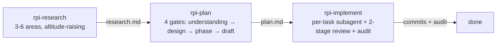

# REPORT CONTENT — Skill Collection Comparison

This is the raw, unformatted content payload for the HTML report. The renderer
in `editorial-parchment` should compose these sections using the components
defined in the html-report references (hero, section, card, callout, table,
diagram, details, quote, grid). Citations in the prose use the form
`path/to/file.md:LINE` (or a range) and should render as inline code.

---

## HERO

- Eyebrow: `context-engineering-workflows · deep research report`
- Title: `Two RPI pipelines, <em>side by side</em>`
- Lede: A complete read of the user's `context-engineering-workflows` skills against the extracted HumanLayer RPI plugin — pipeline shape, phase mechanics, dispatch model, review system, and the things each collection does that the other doesn't.
- Meta-row:
  - DATE: 2026-06-17
  - SCOPE: 9 user skills + 3 user agents vs 22 HumanLayer skills + 7 agents + 26 references
  - READING: ≈ 30 min
  - AUDIENCE: engineer-internal-ramp-up

---

## SECTION 01 — TL;DR

The user's collection and HumanLayer's RPI plugin solve the same problem — disciplined, research-driven implementation of a feature — but with **materially different operating philosophies**. They are not "the same pipeline with cosmetic differences"; they make different bets at almost every fork.

**Where the user is clearly better:**

- **Two-pipeline offering.** You ship both `dw-*` (6-phase, with bias firewall) and `rpi-*` (3-phase, 4-gate). HumanLayer forces the 6-phase path on every task. Picking depth to task is a real ergonomic win.
- **Bias firewall (DW-02).** The `extract-research-questions.sh` script structurally guarantees the research agent cannot see the original prompt. HumanLayer's "don't read ticket.md" is a behavioral rule, not a structural one. Yours is the more honest design.
- **Two-stage review with explicit prompts.** `spec-reviewer-prompt.md` then `code-quality-reviewer-prompt.md`, both shipped as files. HumanLayer collapses this into the implementer-agent's self-review plus human verification between phases.
- **Adversarial plan review (DW-05 step 8).** A separate Opus subagent that reviews the plan *before* implementation starts. HumanLayer has `implementation-reviewer`, but it runs *after* implementation, only for PR deviation analysis.
- **End-of-implementation audit (RPI-implement).** `audit-checklist.md` re-runs success criteria, plan-vs-diff audit, and `/quick-review` as a final cross-task check. HumanLayer stops at the implementer-agent's "done" report.

**Where HumanLayer is clearly better:**

- **Iterate-* skills (9 of them).** `iterate-research`, `iterate-design-discussion`, `iterate-plan`, `iterate-tdd`, `iterate-prd`, plus `review-artifact-comments`. This is the single biggest UX gap. Once you've drafted an artifact, you can revise it in place with explicit feedback channels. The user has no equivalent — you just re-run the create skill.
- **PRD + TDD split.** `create-prd` (product: what + why + UX) is a distinct artifact from `create-tdd` (technical: how). The user's `design-discussion` mixes product and technical, which is fine for internal work but awkward for product work.
- **TDD's System Design / Program Design split.** An explicit cross-component (System Design) vs in-code (Program Design) axis. Re-paint, don't append — design evolves coherently. The user's design-discussion doesn't make this distinction.
- **Vertical-slice phasing.** `create-structure-outline` explicitly forbids horizontal phases ("add all types → add all endpoints → add all UI") and gives a worked example. The user's `dw-04-outline` doesn't make this point.
- **Show-don't-tell design vocabulary.** Program design views: call-stack trees, component trees, file-tree diffs, dependency-injection maps, testing seam maps. All with worked examples in the SKILL.md.
- **Visual artifacts.** `artifact_template.html` (poimandres palette, IDE-like), HTML mockups in PRD, HTML diagrams in TDD, and a generated **PR walkthrough HTML** in `describe-pr` with `inject-walkthrough-diffs.sh` helper. The user has no HTML artifacts.
- **Worktree / workspace setup.** `setup-worktree` plus `configure-workspaces` plus a `.humanlayer/workspace.json` schema with `repos[]`, `pathTemplate`, `branchTemplate`, `copyGlobs`, `primary`, and per-repo overrides. The user works on the current branch and has no workspace concept.
- **Cloud permalinks + comment system.** MCP server (`.mcp.json`) feeds cloud permalinks via hooks (`additionalContext`); `review-artifact-comments` skill + `comment_xml_format.md` for structured, LLM-consumable comment threads. The user has no team-collaboration story.
- **Document precedence chain.** Explicitly enumerated: `plan > structure outline > TDD > design discussion > research > ticket`. When documents conflict, the chain resolves it. The user's design-discussion says "research is locked in" but doesn't formalize.
- **More specialized subagents.** `implementation-reviewer` (deviation analysis), `implementer-agent` (full plan execution), `outline-implementer-agent` (outline execution, with progress tracking in the outline doc), `web-search-researcher`. The user has only the three research agents.

**The verdict.** If you removed the HumanLayer skills from the world, your collection would be a complete, coherent, and competitive RPI/DW system. If you removed your skills and kept HumanLayer's, you'd have a richer single pipeline. **The two are not substitutes; they're complements with different priors.** The single most valuable thing you can adopt is the iterate-* pattern. The second most valuable is the vertical-slice phasing. Everything else is refinement.

> One critical caveat: **the HumanLayer LICENSE explicitly forbids extracting, copying, and creating derivative works.** The materials in `~/code/humanlayer-skills/` exist because you (or someone) reverse-engineered a binary, which the LICENSE also forbids. You can read, analyze, and learn from them. You cannot "just copy" the skills or templates. See §03.

---

## SECTION 02 — The License Question (read this first)

HumanLayer's LICENSE in the extracted repo (`/Users/sanzoner/code/humanlayer-skills/extracted/LICENSE`) is explicit and restrictive. It is copyright 2025 QueryTale, Inc. d/b/a HumanLayer, and the additional restrictions section states:

> Notwithstanding anything in the Agreement to the contrary, users may not:
> - Extract these materials from the Services or retain copies of these materials outside the Services
> - Reproduce or copy these materials, except for temporary copies created automatically during authorized use of the Services
> - Create derivative works based on these materials
> - Distribute, sublicense, or transfer these materials to any third party
> - Make, offer to sell, sell, or import any inventions embodied in these materials
> - Reverse engineer, decompile, or disassemble these materials

The extraction itself — the `extract_all.py` script that pulls skills and templates from the `__BUN` Mach-O segment of the `riptided` binary — is the "reverse engineering" the LICENSE prohibits. The materials in your `~/code/humanlayer-skills/` repo exist in tension with the LICENSE.

**What this means concretely:**

- You **can** read, analyze, and learn from the patterns. You have the materials in hand; using them to inform your own design is reasonable.
- You **cannot** copy `SKILL.md` files, templates, or prompts verbatim into your repo.
- You **cannot** ship "iterate-research" that is a light edit of HumanLayer's `iterate-research.md`.
- You **cannot** "just replace" your `rpi-research/SKILL.md` with the extracted one, even if you rewrite the frontmatter.
- You **can** write your own `iterate-research` from scratch, informed by the pattern, citing the inspiration.

This report does not contain verbatim copies of HumanLayer's skill text. It cites the file paths and patterns, describes the design choices, and recommends what to adopt — and what to write yourself. The recommendation in §22 honors this: where it says "adopt," it means "write your own version of this pattern," not "copy this file."

---

## SECTION 03 — Side-by-side inventory

A literal file count, then a side-by-side table.

**The user (`context-engineering-workflows`)** — 9 skills, 3 agents, 5 helper files.

```
skills/
├── dw-01-research-questions/SKILL.md
├── dw-02-research/SKILL.md  + extract-research-questions.sh
├── dw-03-design-discussion/SKILL.md
├── dw-04-outline/SKILL.md
├── dw-05-plan/SKILL.md  + plan-review-prompt.md
├── dw-06-implement/SKILL.md  + implementer/spec/code-quality-reviewer-prompt.md
├── rpi-research/SKILL.md
├── rpi-plan/SKILL.md  + plan-template.md
├── rpi-implement/SKILL.md  + implementer/spec/code-quality-reviewer-prompt.md + audit-checklist.md
└── shared/setup.sh
agents/
├── codebase-analyzer.md
├── codebase-locator.md
└── codebase-pattern-finder.md
```

**HumanLayer (`riptided` RPI plugin v0.30.4)** — 22 skills, 7 agents, 26 references.

```
skills/
├── ci-commit
├── configure-workspaces
├── create-design-discussion
├── create-plan
├── create-prd
├── create-research
├── create-research-questions
├── create-structure-outline
├── create-tdd
├── describe-pr
├── implement-outline
├── implement-plan
├── iterate-design-discussion
├── iterate-implementation
├── iterate-plan
├── iterate-prd
├── iterate-research
├── iterate-research-questions
├── iterate-structure-outline
├── iterate-tdd
├── review-artifact-comments
└── setup-worktree
agents/
├── codebase-analyzer
├── codebase-locator
├── codebase-pattern-finder
├── implementation-reviewer
├── implementer-agent
├── outline-implementer-agent
└── web-search-researcher
references/  (26)
├── 6 templates (research_questions, research, design_discussion, structure_outline, plan, prd, tdd)
├── 12 final-answer files (one per phase × state, e.g. plan_final_answer / plan_final_answer_in_worktree / plan_final_answer_disabled)
├── artifact_template.html
├── pr_walkthrough_example.html
├── pr_description_template.md
├── comment_xml_format.md
└── inject-walkthrough-diffs.sh
```

**Counts compared:**

| Dimension | User | HumanLayer | Notes |
|---|---|---|---|
| Pipeline count | 2 (DW + RPI) | 1 | User offers depth choice; HL forces 6-phase |
| Skills (user-invocable) | 9 | 22 | HL has 9 iterate-* + setup/configure/describe |
| Subagents | 3 (research) | 7 (research + implementer × 2 + reviewer) | HL's implementers are first-class |
| Reference templates | 2 (plan-template, audit-checklist) | 7 (one per major artifact) | HL ships a template per artifact type |
| Final-answer templates | 0 | 12 | HL ships pre-baked "Next Steps" blurbs |
| Helper shell scripts | 1 (extract-research-questions.sh) | 1 (inject-walkthrough-diffs.sh) | One is bias firewall, one is artifact injection |
| Review prompts as files | 4 (spec + code-quality, both pipelines; plan-review) | 0 (folded into agent prompts) | User ships reviewer prompts as separate files |
| HTML artifacts / templates | 0 | 3 (artifact_template.html, pr_walkthrough_example.html, plus generated outputs) | Major capability gap |
| MCP integration | 0 | 1 (`.mcp.json` → humanlayer MCP) | HL has cloud + comment system |
| Plugin / marketplace | `.claude-plugin/marketplace.json` + `plugins/{dw,rpi}/` | `plugin.json` only | User ships proper Claude Code marketplace |

---

## SECTION 04 — Pipeline architecture: visual side-by-side

The user's DW pipeline and HumanLayer's create-* pipeline are both 6-phase, but the phase boundaries and the inputs to each phase differ in important ways. The RPI pipeline is a 3-phase subset that skips the bias-fence.

**User's DW pipeline:**

```mermaid
graph LR
  A["dw-01 research-questions<br/>tickets + distil + 5-20 questions"] -->|handoff:<br/>00-ticket.md + 01-research-questions.md| B["dw-02 research<br/>bias firewall (no ticket access)"]
  B -->|02-research.md| C["dw-03 design-discussion<br/>summary + questions + recommendations"]
  C -->|03-design-discussion.md| D["dw-04 outline<br/>NEW/MODIFY/DELETE × phases"]
  D -->|04-structure-outline.md| E["dw-05 plan<br/>TDD tasks + adversarial plan review"]
  E -->|05-plan.md| F["dw-06 implement<br/>per-task subagent + 2-stage review"]
  F -->|commits| G[done]
```



**User's RPI pipeline:**



**HumanLayer's create-* pipeline:**

```mermaid
graph LR
  A["create-research-questions<br/>3-8 questions + design-system check"] -->|research-questions| B["create-research<br/>documentarian + specialized agents"]
  B -->|research| C["create-design-discussion<br/>design questions in OPEN state"]
  C -->|design-discussion| D["create-structure-outline<br/>vertical slices, file changes"]
  D -->|structure-outline| E["create-plan<br/>code examples, success criteria"]
  E -->|plan| F["create-tdd<br/>system design + program design"]
  F -->|tdd| G["create-prd<br/>product requirements + HTML mockups"]
  G -->|prd| H["setup-worktree<br/>git worktree + workspace.json"]
  H -->|worktree| I["implement-plan OR implement-outline<br/>per-phase subagent + human verification"]
  I -->|commits| J["describe-pr<br/>deviation analysis + HTML walkthrough"]
  J -->|PR| K[done]
```



**Phase-count delta:**

| | User DW | User RPI | HumanLayer |
|---|---|---|---|
| Phases | 6 | 3 | 6-8 (counting PRD + TDD + setup-worktree + describe-pr) |
| Optional docs | 0 | 0 | PRD, TDD (parallel tracks) |
| Iterability | re-run the same skill | re-run the same skill | dedicated `iterate-*` skill per artifact |
| Fresh conversation per phase | explicit ("in a **fresh conversation**") | explicit | implicit (skill-driven) |

**Key shape differences:**

1. **PRD + TDD are parallel tracks in HumanLayer, not a linear phase.** In the user's `dw-03-design-discussion`, the document mixes product (what/why) with technical (how). HumanLayer splits this: PRD answers "what/why," TDD answers "how," and both can iterate independently. This is a real ergonomic difference for product work.
2. **Worktree setup is a discrete skill in HumanLayer.** `setup-worktree` is a 4-step process that creates a `.humanlayer/workspace.json` if missing, copies globs, runs setup commands, and checks out a fresh branch. The user has no worktree concept.
3. **PR description is a discrete skill in HumanLayer.** `describe-pr` reads the diff, generates a deviation analysis (using `implementation-reviewer`), and emits an HTML walkthrough with `inject-walkthrough-diffs.sh`. The user has no PR automation.

---

## SECTION 05 — Phase 1: Research Questions

The user's `dw-01-research-questions/SKILL.md` and HumanLayer's `create-research-questions.md` are similar in intent (decompose the prompt into investigative questions) but differ in structure, count, and integration.

**User's DW (`dw-01-research-questions/SKILL.md:60-94`):**
- 5-20 questions, distributed across 6 categories
- Categories: Subsystem Understanding, Code Tracing, Pattern Discovery, Dependency Mapping, Boundary Identification, Constraint Discovery
- Explicit FORBIDDEN patterns: "How should we...", "What's the best way to...", "Would it be better to...", "Can we..."
- "Every question must be objective, specific, grounded"
- Dispatches `codebase-locator` for context
- Writes `00-ticket.md` (preserves the original prompt) + `01-research-questions.md`

**HumanLayer (`create-research-questions.md:62-71`):**
- 3-8 questions (less than 8 except for the largest tasks)
- Loose numbered list, no fixed categories
- CRITICAL: questions don't leak implementation; "NO 'HOW WOULD WE XYZ' - ONLY 'HOW DOES IT WORK'"
- **Mandatory design-system check for UI work** (`create-research-questions.md:88-101`): "If the ticket might involve frontend work or new/updated visual components, YOU MUST ensure research questions cover the project's design system. Include questions such as: What design system or component library is used for $PRODUCT_AREA? What are the patterns around primary colors (with hex codes)..."
- Cloud permalinks via hooks
- Writes to `.humanlayer/tasks/TASKSLUG/NN-research-questions-DESCRIPTION.md`

**Differences:**

| | User | HumanLayer | Verdict |
|---|---|---|---|
| Question count | 5-20 | 3-8 (up to 8 only for large) | HL is more disciplined about scoping |
| Question structure | 6 categories with examples | Free-form numbered list | User's categories help the agent reason about question *type* |
| Forbidden patterns | Explicit list of 4 phrases | One bold CRITICAL line | User is more thorough about anti-patterns |
| UI/design system check | None | Mandatory with worked example | **HL is better here** — caught in advance |
| Cloud permalinks | No | Yes (via hooks) | **HL is better** (requires their infra) |
| Ticket preservation | Writes 00-ticket.md | Ticket already in `.humanlayer/tasks/<slug>/ticket.md` | Equivalent outcome, different placement |
| Pre-flight dispatch | Yes (codebase-locator) | Yes (any of the 3 research agents) | Equivalent |

**The one concrete thing worth adopting:** the design-system-mandatory check. The user currently has no design-system coverage in research questions. For projects that touch UI, this is a real gap — research will document the code, but mockups need design system knowledge. The fix is to add a design-system-mandatory block to `dw-01-research-questions` and `rpi-research` (in the form-research section).

---

## SECTION 06 — Phase 2: Research

Three artifacts converge here: the user's DW research (`dw-02-research`), the user's RPI research (`rpi-research`), and HumanLayer's `create-research`. They share a "documentarian stance" and a "dispatch parallel sub-agents" pattern, but differ on **bias firewall**, **altitude-raising**, **verification**, and **template rigor**.

**User's DW (`dw-02-research/SKILL.md`):**
- BIAS FIREWALL: must not read `00-ticket.md`; questions extracted via `extract-research-questions.sh`
- Subagent prompt wrapper: "You are a documentarian. Answer the following question by reading the codebase. Report ONLY what exists."
- Subagent routing table by question category (e.g., Pattern Discovery → codebase-pattern-finder)
- Compiles findings with COMPLETE / INCOMPLETE markers
- Cross-references
- Final summary: System State, Patterns Found, Constraints & Invariants

**User's RPI (`rpi-research/SKILL.md`):**
- Documentarian stance
- **Solution-shaped query normalization** (`rpi-research/SKILL.md:60-72`): if the query is solution-shaped, normalize to neutral codebase questions
- **Validation trap warning**: a query that asks you to "validate, confirm, or check an existing doc" is the most dangerous shape — re-frame to investigate the underlying problem independently, including disconfirmation angles
- **3-6 research areas**; "Always include one altitude-raising area" (e.g., "how is this subsystem driven in production today, and what did it replace / what is now legacy?")
- Live/used standard: "name the production entry point and the chain to it" — trace to ground, not to a single caller
- Final artifact: Summary, Detailed Findings, Code References, Historical Context, Open Questions

**HumanLayer (`create-research.md`):**
- Documentarian stance (very similar wording)
- Reads mentioned files first (no offset/limit)
- Decomposes into research areas
- Spawns parallel sub-agents
- **Combines related questions** (`create-research.md:73-79`): "Aim for 2-6 well-scoped subagents rather than 1:1 question-to-agent mapping"
- Locator → analyzer progression
- "Wait for ALL sub-agent tasks to complete before proceeding"
- Verify all `rpi/` paths are correct
- Template: `research_template.md` with Summary, Detailed Findings, Code References, Architecture Documentation, Open Questions

**Comparison:**

| Dimension | User DW | User RPI | HumanLayer |
|---|---|---|---|
| Bias firewall | **Yes (structural)** | No | No (behavioral rule only) |
| Documentarian stance | Yes | Yes | Yes |
| Solution-shape normalization | No | **Yes** | No |
| Altitude-raising mandate | No | **Yes** | No |
| Disconfirmation angle | No | **Yes** | No |
| Subagent count | 1 per question (parallel) | 3-6 areas (parallel) | 2-6 (parallel, with combining) |
| "Trace to entry point" | Implicit | **Explicit standard** | Mentioned in research agent |
| Architecture documentation section | Patterns + Constraints | Code References + Historical | Architecture Documentation paragraph |
| Open questions | Yes (in summary) | Yes (separate section) | Yes (separate section) |
| Cloud permalinks | No | No | Yes |

**The DW bias firewall is unique and structurally stronger than HumanLayer's "don't read ticket.md" rule.** The `extract-research-questions.sh` script (`skills/dw-02-research/extract-research-questions.sh:23-32`) literally pipes `sed` output of the questions section — the agent literally cannot access the original prompt without explicitly reaching for it via Bash, which is itself a meaningful friction point. HumanLayer's rule is a sentence in a SKILL.md that says "DO NOT read ticket files" with no mechanical enforcement.

**RPI's altitude-raising and disconfirmation mandates are unique wins.** The RPI skill forces the agent to consider the "level up" question (what does this subsystem drive in production? what did it replace?) and forces disconfirmation when the query is a validation request. These are exactly the moves that prevent the most common research failure mode: confirming what you were handed.

**HumanLayer's research template has slightly more structure** (the Architecture Documentation section is a nice prompt for the synthesis), but the *content* it produces is comparable. The user's RPI template is actually more rigorous in requiring a Historical Context section.

---

## SECTION 07 — Phase 3: Design Discussion

The user's `dw-03-design-discussion` and HumanLayer's `create-design-discussion` are similar in shape (Summary of changes / Current state / Desired end state / What we're not doing / Patterns to follow / Design questions), but diverge on **resolution mechanism**, **auto mode**, **targeted exploration**, and **diagram usage**.

**User's DW (`dw-03-design-discussion/SKILL.md`):**
- Reads `02-research.md` AND `00-ticket.md` (the prompt re-enters the pipeline here)
- Synthesizes: Summary of Changes Requested, Current State, Desired End State, What We're Not Doing, Patterns to Follow
- Identifies design questions; 2-4 options per question, each citing a research finding
- **Step 5b: Targeted exploration** (`dw-03-design-discussion/SKILL.md:127-148`): "if research findings are INCOMPLETE and the gap affects a design decision" — do bounded lookups (capped at 5) using Read/Grep/Glob
- **Auto mode** (`--auto` flag, `dw-03-design-discussion/SKILL.md:170-176`): skip interactive prompts; accept all recommendations
- Two resolution modes: Batch (user answers all) or Accept recommendations
- Each option has "Decision" and "Implementation implication" fields

**HumanLayer (`create-design-discussion.md`):**
- Reads research, design, ticket
- Optional research agents
- **All design questions in OPEN state** (`create-design-discussion.md:88-97`): "Put ALL questions under 'Design Questions', NOT under 'Resolved Design Questions'. You may recommend an option, but you must NOT resolve or close a question yourself. Only the user can resolve a design question — through explicit feedback or approval."
- Same structure: Summary of change request, Current State, Desired End State, What we're not doing, Proposed End State Architecture (with Before/After mermaid), Design Questions, Resolved Design Questions, Patterns to follow
- Document precedence: `design discussion > research > ticket`

**Comparison:**

| Dimension | User DW | HumanLayer |
|---|---|---|
| Reads original prompt? | Yes (00-ticket.md) | Yes (ticket.md) |
| Auto mode | Yes (`--auto` flag) | No (always interactive) |
| Research-gap fill mechanism | **Step 5b (5-lookups cap)** | Sub-agents (unbounded) |
| Open/closed state of questions | Mix (resolved interactively or auto) | **Always OPEN initially; user resolves** |
| Before/After mermaid diagrams | Not required | **Required in template** |
| Document precedence | Implicit | **Explicit chain** |
| Cloud permalinks | No | Yes |

**Step 5b is a quietly excellent design.** Rather than re-running the research phase or spawning a fresh sub-agent, the user gives the design skill a tightly bounded ability to fill specific gaps: 5 lookups, no open-ended exploration. This is exactly the right shape — research is locked in, but the design phase can sharpen it where needed.

**HL's "always OPEN" rule is more conservative and probably more correct.** Even with `--auto`, the user's design-discussion resolves questions silently. HumanLayer refuses to resolve anything, even if the answer is obvious, on the principle that the user must own the decision. This is the right default for product work; `--auto` is the right escape hatch for batch work.

**The right synthesis:** Adopt HL's "always OPEN" as the default. Keep `--auto` as an explicit escape hatch (which is what the user already has, but document it as "batch mode" rather than the default).

**HL's before/after mermaid diagrams are a real win** for design documents. The user's template has a `Current State` and `Desired End State` section but doesn't require diagrams. For non-trivial changes, a before/after mermaid is much clearer than prose. Adopt: add a `### Proposed End State Architecture` section to the user's design-discussion template with mandatory Before/After mermaid blocks.

---

## SECTION 08 — Phase 4: Structure Outline

The user's `dw-04-outline` and HumanLayer's `create-structure-outline` produce the same artifact (a phased plan with file changes and validation), but HumanLayer's adds a strong **vertical-slice principle** and a **progress-tracker convention**.

**User's DW (`dw-04-outline/SKILL.md`):**
- Translates design to file changes
- File impact table: File | Action | Phase(s) | Reason
- Phase fields: Scope, Files, Dependencies, Validation
- Risk register
- "What We're NOT Doing" carried forward

**HumanLayer (`create-structure-outline.md`):**
- **Vertical-slice principle** (`create-structure-outline.md:60-79`): "Order phases vertically rather than horizontally - wire everything together in a testable way and then add functionality incrementally. Each phase should ideally be a thin vertical slice that touches all / as many layers as possible for the desired end state. Avoid horizontal phases like 'add all types', 'add API endpoints', 'implement UI'."
- Worked example: "A vertical slice cuts through the stack: 1. User can create the simplest version of the thing end-to-end; 2. User can edit one field end-to-end; 3. User can see the first validation error end-to-end"
- File changes with descriptions (not full code)
- Validation: Automated Verification (runnable commands) + Manual Verification (specific steps)
- **Implementation Overview with checkboxes** (`- [ ] Phase 1: Title` at the top): gets checked off as phases complete
- Document precedence: `structure outline > design discussion > research > ticket`

**Comparison:**

| Dimension | User DW | HumanLayer |
|---|---|---|
| Phase granularity | Any | **Explicit vertical-slice mandate** |
| File impact table | Yes | No (file changes listed per phase) |
| Phase Progress checkboxes | No (in plan, not outline) | **Yes (in outline, checked during implement)** |
| Risk register | Yes | Open Questions (similar) |
| Validation: Automated | Implicit | **Explicit subsection per phase** |
| Validation: Manual | Implicit | **Explicit subsection per phase** |
| Scope guards per phase | No | No (in plan) |
| Document precedence | Implicit | **Explicit chain** |

**The vertical-slice mandate is a real win.** Horizontal phasing is a common failure mode (build all the types, then all the endpoints, then all the UI — only at the end do you discover the integration doesn't work). The user's outline doesn't make this point, so an agent could legally produce a 4-phase "all types, all endpoints, all UI, all tests" plan. The user is currently protected only because the plan review (DW-05 step 8) catches horizontal phasing. Adding the vertical-slice mandate to `dw-04-outline` would prevent the failure mode at design time rather than review time.

**The Implementation Overview checkboxes are a small but real ergonomic win.** They give the implementer a single, scannable progress list at the top of the document. The user's plan has Phase Progress / Task Completion tables in the plan, but the outline doesn't have an at-a-glance checklist. Adopt: add `- [ ] Phase N: Title` checkboxes at the top of the outline (and the plan).

---

## SECTION 09 — Phase 5: Plan

The user's `dw-05-plan` and `rpi-plan/plan-template.md` (which is a near-copy of the DW format) and HumanLayer's `create-plan` produce very similar artifacts. The differences are: **adversarial plan review**, **execution progress tracker**, **zero-context prompt to implementer**, and **template completeness**.

**User's DW (`dw-05-plan/SKILL.md`):**
- TDD task structure: Step 1 failing test, Step 2 run expect fail, Step 3 implement, Step 4 run expect pass, Step 5 commit
- **Adversarial plan review (Step 8)** (`dw-05-plan/SKILL.md:215-237`): dispatches an Opus subagent using `plan-review-prompt.md` to find Critical / Important / Advisory issues *before* implementation begins
- Verdict: APPROVED / APPROVED WITH CONDITIONS / REVISE
- **Execution Progress tracker** (Step 7): Phase Progress, Task Completion, Deviation Log
- The implementer prompt: "Write comprehensive implementation plans assuming the engineer has zero context for our codebase and questionable taste."

**User's RPI (`rpi-plan/plan-template.md`):**
- Same as DW format (uses plan-template.md)
- Has additional sections: Research Context, Files in scope, Patterns to follow, Constraints, Assumptions
- Gates: Understanding → Design → Phase → Draft

**HumanLayer (`create-plan.md`):**
- Convert each phase into detailed implementation steps
- Include specific code examples
- Automated + manual success criteria
- Document precedence: `plan > structure outline > TDD > design discussion > research > ticket`
- Code examples inline (not separate per-task files)

**Comparison:**

| Dimension | User DW | User RPI | HumanLayer |
|---|---|---|---|
| TDD task structure | Yes | Yes | Yes (similar) |
| Code examples per task | Yes (with TDD steps) | Yes (with TDD steps) | Yes (diff blocks) |
| Adversarial plan review | **Yes (Opus subagent)** | No | No |
| Execution progress tracker | **Yes (Phase + Task + Deviation)** | Yes (via template) | Checkbox list only |
| "Zero context" framing | **Yes (explicit)** | No | No |
| Research context embedded | No | **Yes (in template)** | No (in research doc) |
| Patterns to follow | No (in design doc) | **Yes (in template)** | No (in design doc) |
| Document precedence | Implicit | Implicit | **Explicit chain** |

**The adversarial plan review is unique and powerful.** It runs the plan through a separate Opus agent looking for Critical / Important / Advisory issues with a structured checklist (Requirements Traceability, Completeness, Spec Alignment, Buildability, Logic Correctness, Security, Performance, Availability, Data Integrity, Regression Risk, Best Practices, Testability). The verdict gates implementation. This is an enormous quality lever that HumanLayer has no equivalent for.

**The execution progress tracker is a real win for resumability.** When implementation is interrupted (out of context, end of session, context switch), the implementer can read the `## Execution Progress` section and know exactly where to resume. HumanLayer's checkbox list works, but the user's tracker is more structured (Phase Progress table + Task Completion table + Deviation Log).

**HL's plan template is sparser** — it doesn't include Research Context, Files in scope, or Patterns to follow inline. The user gets these from the design-discussion and the research docs. This is a small ergonomic gap.

---

## SECTION 10 — Phase 6: Implement

The user's `dw-06-implement` and `rpi-implement`, and HumanLayer's `implement-plan` / `implement-outline`, produce the same outcome (committed code that passes tests) but with **materially different review models**.

**User's DW (`dw-06-implement/SKILL.md`):**
- Per task: implementer subagent (sonnet) → spec-reviewer subagent (sonnet) → code-quality-reviewer subagent (sonnet)
- Spec reviewer: "DO NOT trust the report" — verify by reading code, find missing/extra/misunderstood
- Code quality reviewer: Critical / Important / Minor, ready-to-merge verdict
- "Never" rules: skip reviews, dispatch multiple implementers in parallel, let self-review replace external review
- **Session review at end**: dispatches `/quick-review` on the SHA range
- Model: sonnet for ALL dispatches

**User's RPI (`rpi-implement/SKILL.md`):**
- Same per-task loop as DW
- Model: opus for code-quality reviewer and quick-review; sonnet for implementer and spec reviewer
- **End-of-impl audit** (`audit-checklist.md`):
  - Part 1: Re-run all phase success-criteria commands
  - Part 2: Plan-vs-diff audit (`git diff --stat <merge-base>..HEAD`, verify claimed SHAs and claimed file changes)
  - Part 3: `/quick-review` on branch diff
  - Aggregate findings → if Critical/Significant, AskUserQuestion which to fix → apply fixes via fresh implementer subagents

**HumanLayer (`implement-plan.md`):**
- Per phase: dispatches `rpi:implementer-agent` (sonnet) which reads the plan, implements, tests, commits, self-reports
- "Pause for human verification" between phases
- Manual verification (whatever the plan says) is done by the human
- No explicit spec-compliance or code-quality subagent review per phase
- Waits for human confirmation before next phase

**HumanLayer (`implement-outline.md`):**
- Same as implement-plan but uses `outline-implementer-agent`
- **Progress tracking in the outline doc itself** (`implement-outline.md:42-48`): "Validation checkboxes: `- [ ]` → `- [x]` when automated verification passes; Phase titles: `## Phase N: Title` → `## ✅ Phase N: Title` when all phase validation is confirmed"
- The outline-implementer-agent has `model: inherit` (not sonnet) — interesting choice

**Comparison:**

| Dimension | User DW | User RPI | HumanLayer |
|---|---|---|---|
| Per-task implementer dispatch | Yes (sonnet) | Yes (sonnet) | Yes (sonnet, model: inherit for outline) |
| Spec compliance review | **Yes (separate subagent)** | **Yes (separate subagent)** | No (folded into self-review + human) |
| Code quality review | **Yes (separate subagent)** | **Yes (separate subagent, opus)** | No (folded into self-review + human) |
| End-of-impl audit | `/quick-review` session | **3-part audit (success criteria + plan-vs-diff + quick-review)** | None |
| Progress tracking | `TodoWrite` (Claude Code native) | `TodoWrite` + `plan.md` Task Completion table | In the outline doc itself (checkboxes + ✅) |
| Human verification cadence | At end (session review) | At end (audit) | **Per phase (between implementer dispatches)** |
| Model: reviewer | sonnet | opus for code-quality | N/A |

**The two-stage review (spec + code quality) is the user's biggest quality win.** HumanLayer collapses this into the implementer-agent's self-review and human verification. The user has 3 separate subagent roles per task: implementer, spec reviewer, code quality reviewer. Each has its own prompt file with its own review checklist. The spec reviewer's "DO NOT TRUST THE REPORT" directive is exactly the right frame — the implementer may have skipped something or over-built, and the spec reviewer is the only agent whose job is to verify what was actually built matches what was asked for.

**The RPI audit checklist is a strong second.** It catches what per-task reviews cannot: cross-task regressions, scope creep between phases, and unverified success criteria. HumanLayer's lack of an end-of-impl audit is a real gap.

**HumanLayer's per-phase human verification** is a different bet. The user trusts subagent reviews to find issues; HumanLayer trusts the human to test between phases. The user's bet is more scalable (humans get fatigued, subagents don't), but HumanLayer's bet catches UX issues that no subagent can.

**HL's outline progress tracking in the doc itself** is a nice touch. The user's plan has a Task Completion table; HL's outline has both checkboxes (granular) and `## ✅ Phase N: Title` markers (phase-level). Adopting the ✅ marker convention in the user's plan would make phase-completion status more scannable.

**The user's `model: sonnet` for the code-quality reviewer in DW is probably under-spec'd.** RPI uses opus for this role, which is more in line with the "careful judgment" needed for a code review verdict. Adopt: bump DW's code-quality reviewer to opus.

---

## SECTION 11 — Subagent model: who does what

The user has 3 agents; HumanLayer has 7. The 4 extras are not just for show — they fill real gaps.

**User's 3 agents:**

| Agent | Purpose | Tools | Model |
|---|---|---|---|
| `codebase-locator` | Find files by feature | Grep, Glob, LS, Bash | sonnet |
| `codebase-analyzer` | Trace data flow, document behavior | Read, Grep, Glob, LS, Bash | (default) |
| `codebase-pattern-finder` | Find 3-4 ready-to-copy patterns | Grep, Glob, Read, LS, Bash | sonnet |

**HumanLayer's 7 agents:**

| Agent | Purpose | Tools | Model |
|---|---|---|---|
| `rpi:codebase-locator` | Find files by feature | Grep, Glob, Bash | sonnet |
| `rpi:codebase-analyzer` | Trace data flow, document behavior | Read, Grep, Glob, LS | sonnet |
| `rpi:codebase-pattern-finder` | Find 3-4 ready-to-copy patterns | Grep, Glob, Read, Bash | sonnet |
| `rpi:web-search-researcher` | External docs (WebSearch, WebFetch) | WebSearch, WebFetch, TodoWrite | sonnet |
| `rpi:implementer-agent` | Full plan execution phase-by-phase | Read, Edit, Write, Grep, Glob, Bash, TodoWrite | sonnet |
| `rpi:outline-implementer-agent` | Outline execution with progress tracking | Read, Edit, Write, Grep, Glob, Bash, TodoWrite | **inherit** |
| `rpi:implementation-reviewer` | Compare implementation to plan, deviation analysis | Read, Grep, Glob, Bash | sonnet |

**The 4 agents the user is missing:**

1. **`web-search-researcher`** — Used in research for "external documentation (only if genuinely needed)" with detailed `llms.txt` and curl-based fetching strategy. The user has no equivalent. For research on libraries or frameworks, this is a real capability gap.

2. **`implementer-agent`** — Reads a plan and executes it phase by phase. The user has this functionality, but as a sub-prompt file in `dw-06-implement/implementer-prompt.md` rather than a first-class agent. Making it a first-class agent is a minor architectural improvement (so other skills can reference it as a subagent_type).

3. **`outline-implementer-agent`** — Same as implementer-agent but for outlines, with progress tracking in the outline doc. The user has nothing equivalent; the user's `dw-06-implement` and `rpi-implement` are full orchestrators that don't accept a generic implementer dispatch.

4. **`implementation-reviewer`** — Compares implementation to plan, reports deviations. Used in `describe-pr`. The user has the same function as `plan-review-prompt.md` (Opus adversarial review) but only fires pre-implementation. HumanLayer fires it post-implementation as part of PR generation. Adopting this is straightforward: split the existing `plan-review-prompt.md` into `plan-review-prompt.md` (pre) and `deviation-review-prompt.md` (post).

**Subagent prompt style differences:**

- The user's agents have a **performance optimization** section (`codebase-locator.md:23-31`, `codebase-pattern-finder.md:23-32`) and **scope/context limits** sections. HumanLayer's agents are more behavior-focused and have a `What NOT to Do` section instead.
- The user's `codebase-analyzer` mentions "mermaid diagraming language" for diagrams (`codebase-analyzer.md:78`). HumanLayer's doesn't.
- HumanLayer's agents have a CRITICAL block at the top with the documentarian directive; the user's agents also have a "Primary Directive" but the documentarian framing is at the skill level (in `rpi-research/SKILL.md`), not in the agent prompts themselves.
- HumanLayer's agents have a more conversational, almost-friendly tone ("I believe in you, you are a smart cookie :)" in `codebase-locator.md:42`). The user's are more clinical.

**Verdict:** The user's 3 agents are solid. The missing 4 (web-search-researcher, implementer-agent, outline-implementer-agent, implementation-reviewer) fill real gaps. The performance-optimization and scope-limits sections in the user's agents are actually a feature HumanLayer lacks.

---

## SECTION 12 — Documentarian stance: a shared foundation

Both collections adopt a **documentarian stance**: sub-agents and skills document what exists, not what should be. This is a foundational commitment that distinguishes the two collections from generic coding assistants.

**User's phrasing** (from `rpi-research/SKILL.md:23-39`):
> You and all dispatched sub-agents are documenting what exists, not what should exist.
> - DO NOT propose changes, fixes, refactors, or improvements unless the user explicitly asks.
> - DO NOT critique the implementation, surface "issues", or recommend alternatives.
> - DO describe what exists, where, how it works, and how pieces connect.
> - DO trace reachability. "X is called by Y" is incomplete — document the chain to a production entry point...
> - DO surface open questions in the artifact's Open Questions section — but as questions, not as veiled critique.

**HumanLayer's phrasing** (from `create-research.md:11-19`):
> CRITICAL: YOUR ONLY JOB IS TO DOCUMENT AND EXPLAIN THE CODEBASE AS IT EXISTS TODAY
> - DO NOT suggest improvements or changes unless the user explicitly asks for them
> - DO NOT perform root cause analysis unless the user explicitly asks for them
> - DO NOT propose future enhancements unless the user explicitly asks for them
> - DO NOT critique the implementation or identify problems
> - DO NOT recommend refactoring, optimization, or architectural changes
> - ONLY describe what exists, where it exists, how it works, and how components interact

**Both are right.** Both are explicit. Both have "red flags" sections that warn the agent when it's drifting into prescription. The user's is slightly more nuanced (the "trace reachability to a production entry point" rule is unique) and slightly more permissive (allows open questions as questions). HumanLayer's is slightly more absolute (forbids root cause analysis even when explicitly asked, which is more restrictive).

**The user's live/used standard from RPI is unique and important:** "for any component you describe as live, used, active, or in-production, name the production entry point and the chain to it. Treat 'live' as unproven until traced to ground — never infer it from the existence of a single caller. Apply equal tracing depth to components you expect to be live and ones you expect to be dead." This is a load-bearing rule that prevents the most common research failure: declaring something live because it has one caller. Adopt verbatim into the user's design-doc where it isn't already.

---

## SECTION 13 — Subagent dispatch: parallel, scoped, specialized

Both collections dispatch sub-agents in parallel from the main conversation. The dispatch model differs in **count guidance**, **combining**, and **prompt packaging**.

**User's pattern:**

- DW-01 dispatches `codebase-locator` once for context.
- DW-02 dispatches one subagent per question (per `dw-02-research/SKILL.md:84-89`): "Dispatch independent questions in parallel." The category-to-agent table in Step 2 maps each question to an agent type.
- RPI-Research dispatches 3-6 sub-agents in a single message, one per research area (`rpi-research/SKILL.md:88-92`). Includes an altitude-raising area as a mandatory.
- RPI/DW Implement dispatches one implementer per task, then one spec reviewer, then one code quality reviewer — sequentially, not parallel.
- The DW plan review dispatches an Opus subagent for adversarial review.

**HumanLayer's pattern:**

- `create-research-questions` and `create-research` dispatch in parallel.
- `create-research.md:73-79` is explicit: "Combine related questions: Don't necessarily launch one subagent per research question. Group related questions that touch the same area of the codebase into a single subagent prompt... Aim for 2-6 well-scoped subagents rather than 1:1 question-to-agent mapping — this is not a hard rule, just guidance."
- `implement-plan` and `implement-outline` dispatch one implementer-agent per phase, sequentially.
- `describe-pr` dispatches `implementation-reviewer` for deviation analysis.

**Comparison:**

| Dimension | User | HumanLayer |
|---|---|---|
| Parallel dispatch in research | Yes | Yes |
| Dispatch count guidance | Per-question (DW) or 3-6 areas (RPI) | **2-6 with combining** |
| Pre-dispatch reading | Yes (DW) | Yes (reads mentioned files FULLY) |
| Subagent prompt packaging | Inline string in skill | Inline string in skill |
| Specialized subagents used in dispatch | 3 | **7 (including web-search, implementer)** |

**HL's "combine related questions" guidance is a quiet win.** The user's DW dispatches one subagent per question, which can fragment the work — 3 subagents each looking at adjacent code in the same module. HL's guidance to combine related questions into a single dispatch keeps the agent's context coherent and reduces redundant cross-referencing.

---

## SECTION 14 — The review system: spec + quality + audit

Both collections use subagent reviews, but they differ in **where** the reviews fire and **how many** there are.

**User's review model:**

| Stage | Reviewer | Trigger |
|---|---|---|
| After plan drafted | `plan-review-prompt.md` (Opus) | DW-05 step 8 |
| Per task, after implementer | `spec-reviewer-prompt.md` (sonnet) | dw-06-implement / rpi-implement |
| Per task, after spec review | `code-quality-reviewer-prompt.md` (sonnet DW / opus RPI) | dw-06-implement / rpi-implement |
| After all tasks | `/quick-review` session (sonnet DW / opus RPI) | dw-06-implement / rpi-implement |
| After all tasks (RPI only) | `audit-checklist.md` (3-part: success criteria + plan-vs-diff + quick-review) | rpi-implement |

**HumanLayer's review model:**

| Stage | Reviewer | Trigger |
|---|---|---|
| After plan drafted | None | — |
| Per task, after implementer | Self-review by implementer-agent | implement-plan / implement-outline |
| Per task, after self-review | Manual human verification | implement-plan / implement-outline |
| After all phases | `implementation-reviewer` (deviation analysis) | describe-pr |
| After PR | User / human reviewer | (external) |

**The user has more reviews at more points, all subagent-driven. HumanLayer relies more on human-in-the-loop verification.**

**Why the user's model is better for most cases:** subagent reviews scale (don't fatigue, are cheap, can run in parallel), catch issues with reproducible criteria, and free the human to focus on the high-leverage decisions. The user's three-stage review (plan → spec → code-quality) catches issues at the points where they are cheapest to fix.

**Why HumanLayer's model has merit:** the human catches UX issues no subagent can, and the per-phase human-verification cadence creates a tight feedback loop. The user's model is best for "I have to ship this" situations; HumanLayer's is best for "I'm learning the codebase" or "this is high-stakes" situations.

**Concrete recommendations:**

1. Bump DW's code-quality reviewer to opus (RPI already does this; the cognitive load is similar).
2. Consider whether the plan-review (DW-05 step 8) is fired too early — currently it runs after the plan is drafted but before the user has reviewed it. Moving it to *after* user review would catch user-introduced issues. (But this might be too much friction; current order is fine.)
3. Adopt HL's `implementation-reviewer` for post-implementation deviation analysis — useful for the yeet/describe-pr workflow the user has elsewhere.

---

## SECTION 15 — Iterability: the single biggest gap

HumanLayer's `iterate-*` skills (9 of them) are the single biggest UX gap in the user's collection. The user has no equivalent: when you want to revise a research doc, you re-run `rpi-research` (with the choice of follow-up append or overwrite). When you want to revise a plan, you re-run `rpi-plan`. The "iterate" framing is missing.

**The iterate skills:**

- `iterate-research-questions`: revise the research-questions doc based on feedback
- `iterate-research`: revise the research doc, possibly dispatching new sub-agents
- `iterate-design-discussion`: revise the design-discussion doc, moving answered questions to "Resolved"
- `iterate-structure-outline`: revise the structure outline
- `iterate-plan`: revise the plan, including code examples
- `iterate-prd`: revise the PRD, including HTML mockups
- `iterate-tdd`: revise the TDD, including system / program design
- `iterate-implementation`: revise the implementation based on bug reports or follow-on feedback
- `review-artifact-comments`: process structured comments on an artifact (uses MCP)

**What makes them work:**

1. Each iterate skill has explicit feedback-handling logic: "If the user gives any input, DO NOT just accept the correction blindly. Spawn new research tasks to verify the correct information. Read the specific files/directories they mention. Only proceed once you've verified the facts yourself."
2. Document-precedence chains are stated: `iterate-design-discussion` says "design discussion captures decisions made AFTER reading the ticket and research. If the ticket says one thing but the design discussion resolved it differently, follow the design discussion."
3. State-mutation is explicit: `iterate-design-discussion` says "Move answered questions to 'Resolved Design Questions' section."

**What the user has instead:** re-run the create skill. This is a worse experience because:
- You have to re-explain context the skill should already have.
- The skill doesn't know what changed in the doc since the last run.
- There's no formal "resolved/open" state machine for design questions.

**Recommendation (top of the list):** Write your own `iterate-*` skills for each of the user's phases. The pattern is straightforward: read the doc, take feedback, update in place, preserve the "open/resolved" state. This is a 4-6 hour investment and the highest-ROI single change in this report.

---

## SECTION 16 — Visual artifacts: a major capability gap

HumanLayer's `artifact_template.html` (poimandres palette, IDE-like styling, badges, stats, before/after code comparisons) and the various places it's used — `create-prd` (HTML mockups), `create-tdd` (HTML diagrams), `describe-pr` (HTML walkthroughs) — are a major capability gap in the user's collection.

**The user has no HTML artifacts.** The user uses:
- graphviz diagrams (in `dw-01-research-questions` handoff, `dw-06-implement` process flow)
- mermaid diagrams (in agent prompts and the design-discussion template)
- Plain markdown

**The user is not worse at diagrams** — graphviz and mermaid are fine. The user is **missing a category of artifact**: HTML pages that look like the user's product, not like a code-block-rich markdown doc. This matters most for:
- PRD mockups: a stakeholder looking at the PRD wants to see what the UI will look like, not a description.
- TDD diagrams: a complex cross-component interaction is much clearer in a hand-designed HTML page than in mermaid.
- PR walkthroughs: a reviewer wants a visual summary of the change, not a markdown diff.

**Concrete recommendation:** Add an `html-artifact` skill (or fold it into the design-discussion / TDD skills) that:
1. Defines a consistent palette and badge vocabulary (similar to HumanLayer's `artifact_template.html`).
2. Shows how to embed an HTML file in a markdown doc (the user would need a syntax like HumanLayer's `task-artifact` block).
3. Provides guidance on when an HTML artifact is worth it (rule of thumb: when the concept has ≥4 interacting components, when the diagram needs annotations, or when the audience is non-engineering).

This is a 1-2 day investment and would close the biggest capability gap.

---

## SECTION 17 — Workspace / worktree setup

HumanLayer's `setup-worktree` plus `configure-workspaces` plus the `.humanlayer/workspace.json` schema is a coherent workspace system the user doesn't have.

**The schema:**

```json
{
  "disabled": false,
  "pathTemplate": "~/.humanlayer/workspaces/{{ TASKSLUG }}/{{ REPOBASENAME }}",
  "branchTemplate": "{{ TASKSLUG }}",
  "sourceRef": "HEAD",
  "setupCommand": "bun install",
  "copyGlobs": [".env", ".env.local", ".claude/settings.local.json", ".humanlayer/workspace.local.json"],
  "repos": [
    { "localPath": ".", "description": "Coordination repo", "primary": true },
    { "localPath": "../api", "description": "API service", "setupCommand": "bun install" }
  ]
}
```

**The semantics:**
- Per-task worktree at `pathTemplate`, branched from `sourceRef`.
- `copyGlobs` (additive merge from defaults → workspace.json → workspace.local.json → per-repo) copy local-only files (secrets, settings) into the worktree.
- `repos[]` enables multi-repo coordination with per-repo `setupCommand`, `sourceRef`, `copyGlobs`, and a single `primary: true` repo that loads skills and config first.
- `disabled: true` at root level disables worktree creation.
- `workspace.local.json` overrides `workspace.json` for machine-specific settings and is gitignored.

**The user has no equivalent.** The user works on whatever branch is checked out. The user's RPI/DW implement doesn't create a worktree; it just executes against the current branch.

**Why this matters:**
- **Isolation**: work in a worktree doesn't pollute the main branch.
- **Parallel work**: multiple worktrees for the same repo enable parallel work on multiple features.
- **Multi-repo**: tasks that span repos (very common) get a coordinated workspace.
- **Setup automation**: `setupCommand` ensures dependencies are installed; `copyGlobs` ensures secrets and local settings are present.

**Concrete recommendation:** Write a `setup-worktree` skill and a `workspace.json` schema. Borrow the schema verbatim — it's well-designed. The user can be inspired by this pattern even though the user is writing their own. This is a 1-day investment.

---

## SECTION 18 — Cloud + comments: collaboration

HumanLayer's MCP integration (`.mcp.json` → humanlayer MCP server) feeds cloud permalinks into every Write/Edit/Read response via the `additionalContext` hook field. The `review-artifact-comments` skill uses MCP tools (`get_artifact_comments`, `update_artifact_comments`, `reply_to_artifact_comment`) to handle structured comment threads on artifacts.

**The user has no equivalent.** The user's artifacts are local markdown files in `~/notes/context-engineering/<repo>/<slug>/`. There's no cloud presence, no permalinks, no comments.

**Why this matters for the user:**
- The user is the only consumer; cloud + comments may be unnecessary. The local `~/notes/` directory is enough.
- BUT: the user does mention they have a "yeet" skill and "submit-pr" skill — these are team-collaboration workflows. The same RPI artifacts could be shared with a reviewer. A cloud permalink is a clean way to do that.

**The license question is sharper here:** the user *could* write their own `review-artifact-comments` skill, but the natural place to store comments is in a third-party service (Linear, GitHub issues, etc.). If the user has a self-hosted Gitea or similar, this is straightforward. If the user wants to use the HumanLayer MCP, that's a non-starter (it requires a HumanLayer account).

**Concrete recommendation:** Skip for now. The user works solo; the local artifact pattern is fine. If the user later collaborates with a team on RPI artifacts, the right answer is GitHub PR comments (using the existing `gh` CLI) rather than building a comment system from scratch.

---

## SECTION 19 — Model selection philosophy

Both collections use sub-agent models, but with different defaults and a different rhythm.

**User's defaults:**
- `codebase-locator`: sonnet
- `codebase-analyzer`: (default — not specified)
- `codebase-pattern-finder`: sonnet
- Implementer / spec reviewer: sonnet
- Code quality reviewer (DW): sonnet
- Code quality reviewer (RPI): opus
- Plan review (Opus adversarial): opus
- Quick-review (DW): sonnet
- Quick-review (RPI): opus

**HumanLayer's defaults:**
- `rpi:codebase-locator`: sonnet
- `rpi:codebase-analyzer`: sonnet
- `rpi:codebase-pattern-finder`: sonnet
- `rpi:web-search-researcher`: sonnet
- `rpi:implementer-agent`: sonnet
- `rpi:outline-implementer-agent`: **inherit** (interesting — uses the parent's model)
- `rpi:implementation-reviewer`: sonnet

**The user uses opus for harder review tasks (plan review, code-quality in RPI, quick-review in RPI). HumanLayer uses sonnet everywhere except the outline-implementer-agent which inherits.** The user's model selection is more thoughtful — the cognitive load of "find what was actually built vs. what was asked" or "find subtle bugs" justifies opus.

**Recommendation:** The user's model selection is good. The only change is to bump DW's code-quality reviewer to opus to match RPI. The user's plan review (opus) is uniquely strong.

---

## SECTION 20 — Concrete recommendations, prioritized

These are the changes I would make to the user's collection, ordered by ROI. The user said "just copy their skills" is acceptable, but the LICENSE forbids that. The recommendations here are all "write your own version of this pattern, inspired by HumanLayer's design."

**Tier 1 — High ROI, low effort (≤ 1 day each):**

1. **Bump DW's code-quality reviewer to opus.** RPI already does this. The cognitive load is the same. Match the two pipelines.
2. **Add design-system-mandatory check to research-questions.** Both `dw-01-research-questions` and `rpi-research` should require design-system coverage when the task involves UI.
3. **Add vertical-slice mandate to `dw-04-outline`.** Make it explicit: "Order phases vertically rather than horizontally." Worked example from HL.
4. **Add before/after mermaid requirement to design-discussion template.** Force the agent to visualize the change.
5. **Add `## ✅ Phase N: Title` markers to the plan template.** Match HL's outline-implementer progress convention.

**Tier 2 — High ROI, medium effort (1-3 days each):**

6. **Write `iterate-*` skills.** This is the single highest-ROI Tier 2 item. Create `iterate-research`, `iterate-design-discussion`, `iterate-plan`, and `iterate-implementation` (4 skills, each ~3-4 hours). This transforms the user experience from "re-run with new context" to "revise in place with feedback."
7. **Add PRD + TDD split.** Write `rpi-prd` and `rpi-tdd` (or `dw-prd` and `dw-tdd`) for product work. The split is real value for product tasks; the user's design-discussion is fine for internal work.
8. **Adopt HL's "always OPEN" rule for design questions.** Drop the default auto-resolve. Keep `--auto` as an explicit batch-mode escape hatch.
9. **Promote `web-search-researcher` to a first-class agent.** Used in research when external docs are needed. The `llms.txt` curl strategy is a nice touch.

**Tier 3 — Medium ROI, high effort (3-7 days each):**

10. **Write a `setup-worktree` skill + workspace.json schema.** Borrow the schema design (different content). The user works on the current branch by default; this is a structural change to the workflow.
11. **Write an `html-artifact` skill + consistent template.** The user has no HTML artifacts. This is a 1-2 day investment for a major capability gain.
12. **Write a `describe-pr` skill with deviation analysis.** Splits the existing `plan-review-prompt.md` into pre-implementation and post-implementation variants. Useful for the yeet/describe-pr workflow.
13. **Make `implementer-agent` and `outline-implementer-agent` first-class subagents.** Currently the user has the implementer prompt as a file in `dw-06-implement/` and `rpi-implement/`. Promoting to first-class agents lets other skills reference them as `subagent_type: "rpi:implementer-agent"`.

**Tier 4 — Strategic, low priority:**

14. **Cloud permalinks + comment system.** Skip unless the user collaborates with a team on RPI artifacts.
15. **Library researcher tool.** Skip — Glean / `mcp__glean_default__search` is the better general answer if the user has it.
16. **`configure-workspaces` skill (interactive).** Skip — the JSON schema is enough; the interview is a UX nicety.

---

## SECTION 21 — Mixed / philosophical differences

Some differences are not "better or worse" — they're different bets about how a research-driven workflow should feel.

**Auto mode.** The user has `--auto` for design-discussion. HumanLayer refuses to auto-resolve. The user bets that some workflows should be batchable (e.g., a CI-style flow). HumanLayer bets that all design decisions need human eyes. The user is right for internal tooling work; HumanLayer is right for product work. Keep both modes.

**Document precedence chains.** HumanLayer's is explicit and chainable: `plan > structure outline > TDD > PRD > design discussion > research > ticket`. The user has an implicit ordering but no formal chain. The explicit chain is a clear win for any workflow that has multiple artifact types in flight.

**"Show, don't tell."** HumanLayer's TDD/PRD explicitly says "show, don't tell" with code-shape sketches (call-stack tree, component tree, file-tree diff, DI map, testing seam map). The user uses prose + tables. The user is fine for most cases; HumanLayer's approach is right for complex code-shape decisions.

**Vertical vs horizontal phasing.** HumanLayer mandates vertical slices. The user doesn't say. The user is more permissive; the user relies on the plan review (DW-05 step 8) to catch horizontal phasing. The user could enforce verticality at outline time instead.

**Documentarian stance nuance.** The user allows open questions as questions and traces reachability to a production entry point. HumanLayer forbids root cause analysis even when asked. The user is slightly more permissive (and more useful for finding dead code). HumanLayer is slightly more absolute (and safer for research that should not drift into prescription).

**Communication cadence.** HumanLayer's "re-paint, don't append" and "ask exactly one question per message" rules are about the *interview* style during TDD/PRD creation. The user doesn't have an equivalent conversational discipline in the design-discussion — it tends to dump all open questions at once. This is a UX gap for the *interactive* experience even if the artifacts are equivalent.

---

## SECTION 22 — Where yours is clearly better (defensive notes)

The user is a complete, coherent, competitive RPI/DW system. The following are places where the user is genuinely ahead, and where copying HumanLayer would be a mistake.

1. **Two-pipeline offering.** `dw-*` and `rpi-*` give the user depth choice. HumanLayer forces the 6-phase path. For small tasks, the user's RPI is much faster; for large tasks, DW with bias firewall is more rigorous. The user should not collapse into a single pipeline.
2. **Bias firewall (DW-02).** Structurally enforced via `extract-research-questions.sh`. HumanLayer's "don't read ticket.md" is behavioral. Keep the firewall; consider extending the same idea to design-discussion (e.g., a `--no-ticket` flag for design phase).
3. **Adversarial plan review (DW-05 step 8).** Opus subagent reviews the plan before implementation. HumanLayer has no equivalent. This is the user's most under-appreciated quality lever.
4. **End-of-impl audit (RPI-implement).** The 3-part audit (success criteria + plan-vs-diff + quick-review) catches cross-task issues per-task reviews cannot. Keep this; it is a different bet than HumanLayer's per-phase human verification, and it scales better.
5. **Performance optimization + scope/context limits in agents.** The user's `codebase-locator` and `codebase-pattern-finder` have these sections. HumanLayer's agents don't. These are useful constraints.
6. **Plugin marketplace.** The user has a real `.claude-plugin/marketplace.json` + `plugins/{dw,rpi}/` structure. HumanLayer is a standalone plugin. The user's distribution story is better.
7. **Audit-checklist as a separate file.** `rpi-implement/audit-checklist.md` is its own file, not embedded in the SKILL.md. This is cleaner architecture for documentation.
8. **TDD step structure in plans.** The user's plan template has explicit "Step 1: failing test → Step 2: run (expect fail) → Step 3: implement → Step 4: run (expect pass) → Step 5: commit" per task. This is more prescriptive than HumanLayer's plan template and produces more reproducible implementations.
9. **"Assume zero context" framing.** The user's DW-05 explicitly says: "Write comprehensive implementation plans assuming the engineer has zero context for our codebase and questionable taste. Document everything they need to know." HumanLayer doesn't have this framing.
10. **RPI's altitude-raising and disconfirmation mandates.** The RPI research phase requires one altitude-raising area per dispatch and disconfirmation angles for validation queries. HumanLayer doesn't have these.

---

## SECTION 23 — The apply-this-without-violating-the-license checklist

For each of the recommendations in §20, this is the safe-to-adopt framing. The user is writing their own version, inspired by HumanLayer's design, not copying HumanLayer's files.

| Recommendation | What to do | What NOT to do |
|---|---|---|
| Bump DW reviewer to opus | Change `model: "sonnet"` in `dw-06-implement` skill to `opus` for code-quality reviewer | — |
| Design-system-mandatory | Write your own `if ui: ensure design system covered` block in research-questions | Copy HL's exact wording from `create-research-questions.md:88-101` |
| Vertical-slice mandate | Write your own "Order phases vertically..." block, citing the principle | Copy HL's worked example verbatim |
| Before/After mermaid | Add a `### Proposed End State Architecture` section to your design-discussion template | Copy HL's template verbatim |
| ✅ Phase markers | Add `## ✅ Phase N: Title` convention to your plan template | Copy HL's exact progress-tracking logic |
| iterate-* skills | Write your own iterate-* skills for each phase | Copy HL's iterate-* files |
| PRD + TDD split | Write your own `rpi-prd` and `rpi-tdd` skills; design your own split | Copy HL's PRD or TDD templates |
| Always OPEN default | Change your design-discussion skill to not auto-resolve | Copy HL's "must NOT resolve" wording |
| web-search-researcher | Write your own `web-search-researcher` agent with your tool list | Copy HL's prompt verbatim |
| setup-worktree | Write your own `setup-worktree` skill and your own `.workspace.json` schema (different name) | Copy HL's `.humanlayer/workspace.json` schema |
| html-artifact | Write your own `html-artifact` skill and your own template (different palette) | Copy HL's `artifact_template.html` |
| describe-pr | Write your own `describe-pr` skill with your own PR description format | Copy HL's `pr_description_template.md` |
| First-class implementer agents | Promote your implementer prompts to first-class agents | Copy HL's `implementer-agent.md` |

**The rule of thumb:** inspired-by-yes, verbatim-copy-no. If you find yourself reaching for HL's exact wording, rephrase. If you find yourself porting HL's exact data structure, redesign.

---

## SECTION 24 — Closing / next steps

This report is a snapshot. The two collections will continue to evolve. If you want to iterate on it, the right next steps are:

1. **Pick 2-3 Tier 1 recommendations and ship them.** Bump the reviewer to opus; add the design-system-mandatory check; add the vertical-slice mandate. Each is ≤ 1 day. Total: 2-3 days.
2. **Pick the single Tier 2 recommendation with the highest ROI for your workflow.** For most users, that is the iterate-* skills. For product-heavy workflows, that is PRD + TDD. For solo work, that is the html-artifact skill.
3. **Schedule a 1-day spike for Tier 3** (setup-worktree, html-artifact, describe-pr) once Tier 1 and Tier 2 are stable.

The two collections are not substitutes. The user has built a strong foundation. The Tier 1 and Tier 2 recommendations would close the biggest UX gap (iterability) and add two missing capabilities (PRD/TDD split, design-system coverage). The Tier 3 recommendations are larger bets that change the workflow shape (worktree, HTML artifacts, PR automation).

End of report.
